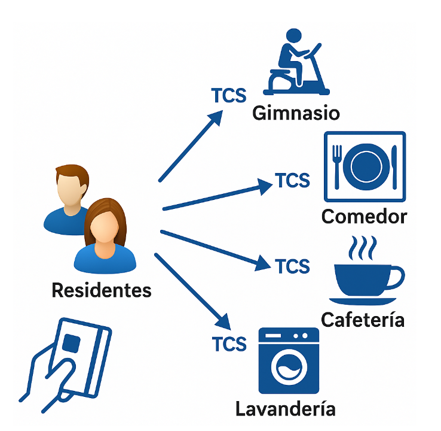
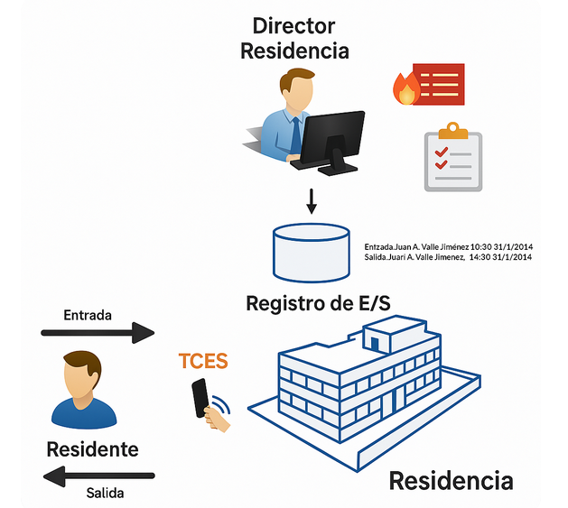

**Entornos de Desarrollo (ED)**
**Unidad de Trabajo 3 (UT3)**
**Tarea 02**

## OBJETIVOS

- Crear diagramas de casos de uso que describan interacciones básicas entre el usuario y el sistema.
- Valorar la utilidad de los diagramas UML para transmitir información técnica de manera fiel y eficiente.

# TA02 Genera un diagrama de casos de uso

## ANALIZA EL FUNCIONAMIENTO DEL SISTEMA DE CONTROL DE ACCESO

Lee atentamente el siguiente caso práctico.
De esta información deberás extraer los casos de uso y los actores que los desarrollan y los posibles sistemas externos que van a interoperar con el nuevo sistema.

1. **ENUMERA y CODIFICA los actores en un listado.**
2. **ENUMERA y CODIFICA los casos de uso en otro listado.**
3. **Realiza el diagrama de casos de uso siguiendo los pasos que hemos visto en clase.**
4. **Documenta uno de los casos de uso que hayas extraído.**
* Tu entrega debe contener: **una portada, un índice, el contenido, una conclusión y bibliografía**.

## Caso de estudio:

Se desea implantar un sistema del control que permita a los residentes de un Colegio mayor el acceso mediante una tarjeta RFID (Radio Frequency IDentification) a una serie de servicios que se ofrecen en la residencia.

El primer objetivo del sistema es controlar el acceso al recinto de la residencia.
El segundo objetivo es permitir controlar el uso de determinados servicios en determinadas estancias como por ejemplo el comedor, la cafetería o el gimnasio.
Cada residente contrata a su llegada, o posteriormente, distintos tipos de servicios. Su tarjeta RFID asociada (que se le proporciona en el momento de formalizar su ingreso), reflejará la activación de estos servicios en función de su elección (Figura 1). Así cada residente podrá elegir si contratar o no el servicio de gimnasio, el de pensión completa o sólo el régimen de desayuno. Esta contratación la hará efectiva el departamento económico a través del sistema, no el residente directamente. Por defecto, la contratación será para todo el curso. Sin embargo, el estudiante puede solicitar la contratación por trimestres.
Cuando el residente acceda a una estancia que ofrece algún servicio, deberá pasar antes por lo que se denomina (Terminal de Control de Acceso al Servicio) o TCS. En cada TCS, el residente pasará su tarjeta sobre un lector RFID del sistema y los conserjes de la residencia podrán ver en un monitor asociado al TCS si el residente tiene o no acceso al servicio para controlar el uso. Para hacer esto el sistema mantendrá activos los lectores de proximidad durante el horario en el que el servicio se puede utilizar.

> Figura 1 Acceso de residentes a diferentes servicios en diferentes estancias TCS

Otra funcionalidad que el sistema debe ofrecer es la de registrar las entradas y salidas de los residentes a la residencia (Figura 2). Esto se realizará mediante los Terminales de control de entrada y salida (TCES). El TCES y la información que proporciona permitirán que el director pueda tomar decisiones posteriormente, como por ejemplo sobre evacuaciones en caso de incendios o determinar el grado de permanencia de los residentes en la residencia. Para ello, el sistema permitirá al director ver el estado de ocupación de la residencia en tiempo real o generar informes de permanencia en función de los meses del año. El director podrá ver estos informes con datos que identifiquen a los residentes que efectivamente se encuentran en la residencia.
La administración y la gestión de las tarjetas se realizan en el departamento económico. Este departamento deberá poder asignar una tarjeta a un residente al contratar, activar en la tarjeta determinados servicios para cada residente y desactivar una tarjeta si fuera necesario. Además, el sistema debe proporcionar a este departamento distintos informes sobre la contratación de los distintos servicios.

> Figura 2 Detalle de registro de entrada/salida al recinto de la Residencia TCES

Dado que el sistema poseerá información contable del número de servicios contratados por cada residente, deberá emitir mensualmente y de forma automática (aunque se podrá cancelar esta emisión explícitamente por el departamento económico) una remesa de cobros, con cargo a cuenta de cada residente. Para esta emisión, se requiere una comunicación remota del sistema con un sistema de emisión de cobros de una entidad bancaria concreta que hace de pasarela y que hará efectiva la remesa. La comunicación se realizará vía protocolo HTTPS usando un API REST que proporciona el sistema de la entidad bancaria en cuestión.
Respecto a la seguridad, el sistema deberá ofrecer garantías de seguridad en el tratamiento de la información que almacena. Por ello semanalmente (proceso periódico) deberá de forma desasistida (es decir sin intervención de ningún operador) copiar la base de datos de producción a otra máquina de respaldo denominada base de datos SCR. Esta máquina ya existe y centraliza todas las copias de seguridad que tiene la residencia en sus instalaciones.
Los administrativos de secretaría deberán poder ver los datos de cada residente, generar informes de ocupación de la residencia. Esta información es fundamental para gestionar la ocupación y las futuras admisiones.
El director será el único que pueda ver el estado de ocupación de la residencia en tiempo real. Si es necesario, el director puede colaborar con los conserjes y los secretarios realizando sus funciones.
El sistema, además, deberá incorporar una funcionalidad de notificación, que permita a los conserjes de la residencia el envío de notificaciones al móvil de cualquier residente. Esta funcionalidad se apoyará en la tecnología Google Cloud Messaging. Los conserjes también podrán solicitar informes de ocupación, pero estos deberán ser anónimos, es decir, sin datos de los residentes.

## Rúbrica

| Calificación | Descripción                                                                                                                                           |
| ------------ | ----------------------------------------------------------------------------------------------------------------------------------------------------- |
| 0            | No se entrega la tarea o se entrega sin sentido ni conexión con el enunciado                                                                          |
| 3            | No se han detectado la mayoría de casos de uso y actores                                      |
| 6            | Se han detectado la mayoría de casos de uso y actores o existe algún caso de uso incorrecto (Tareas que realiza el sistema por sí mismo y no por petición del usuario)          |
| 9            | Se han detectado todos los casos de uso y actores |
| 10           | Se han aportado elementos personales más allá de lo solicitado   |