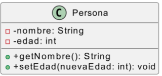
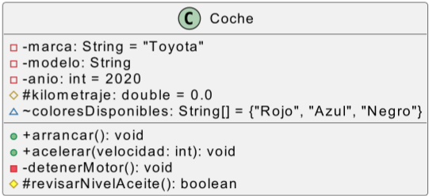
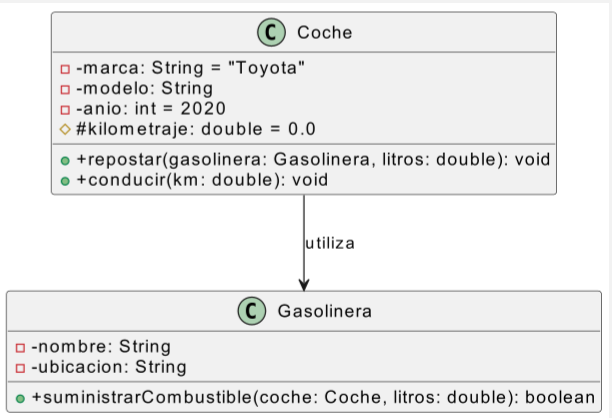
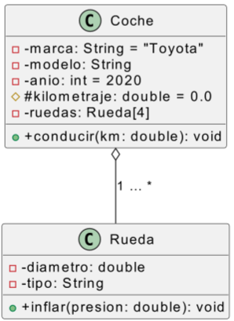
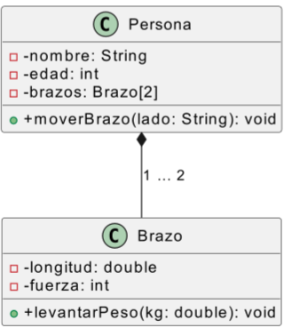
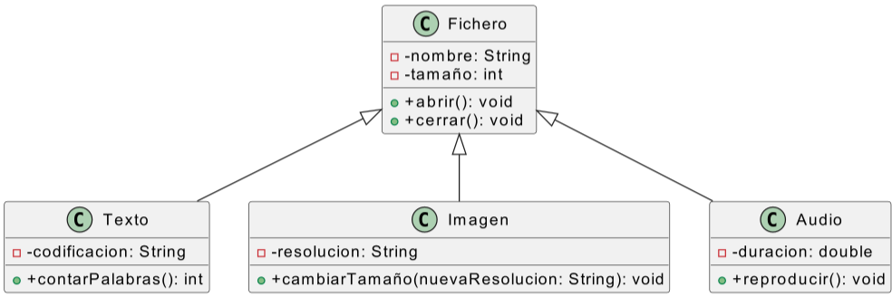
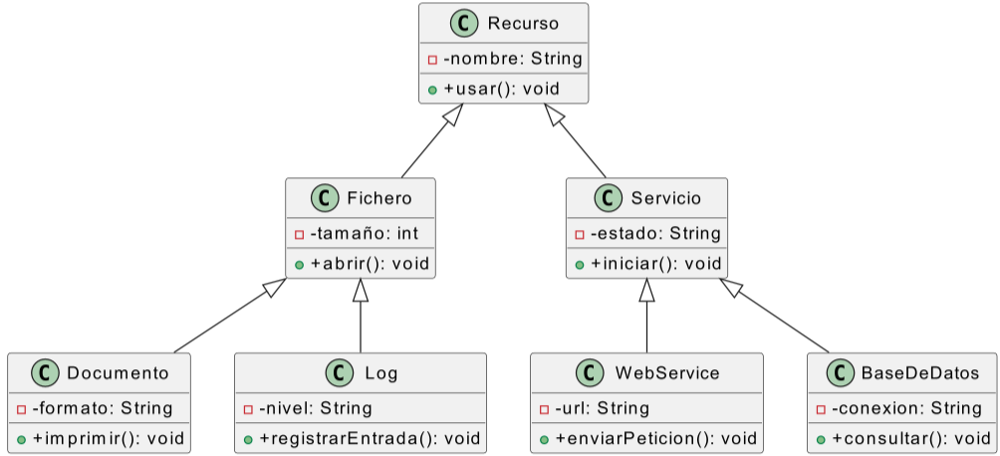
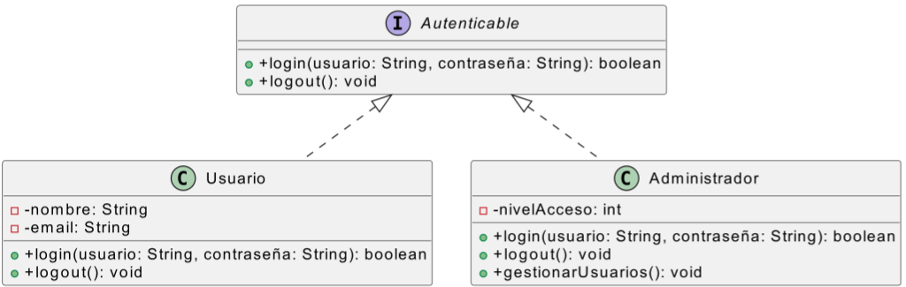
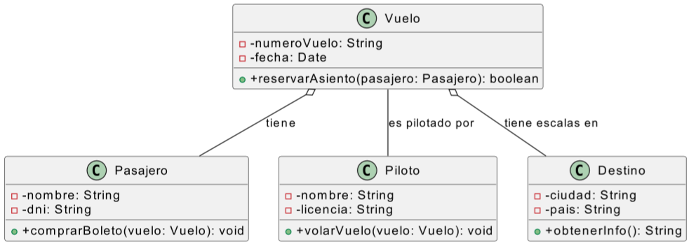
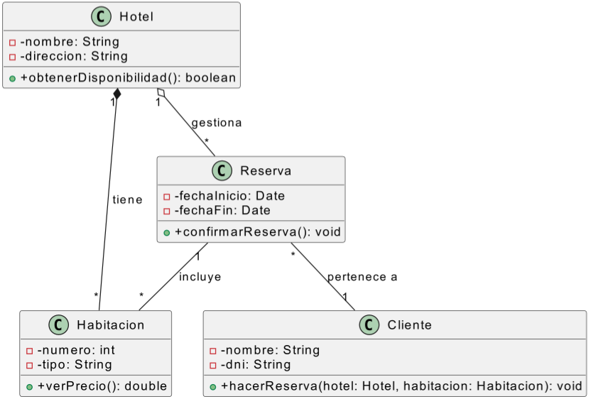

**Entornos de Desarrollo (ED)**
**Unidad de Trabajo 8 (UT8)**
**Tarea 02**

## OBJETIVOS DE APRENDIZAJE

- Identificar los elementos que componen los diagramas de clases.
- Relacionar los diagramas de clases con los conceptos de la programación orientada a objetos.
- Interpretar los diagramas de clases.

# TA02

## Interpreta los siguientes diagramas de clases

Describe los elementos de la Programación Orientada a Objetos que reconozcas.
Escribe el código en java que represente lo más fielmente posible cada diagrama de clases.
No olvides las implicaciones de la relaciones que hemos trabajado en clase.

### 1

### 2

### 3

### 4

### 5

### 6

### 7

### 8

### 9

### 10

## Rúbrica

| Calificación | Descripción                                                                                                                                           |
| ------------ | ----------------------------------------------------------------------------------------------------------------------------------------------------- |
| 0            | No se entrega la tarea o se entrega sin sentido ni conexión con el enunciado                                                                          |
| 3            | Se han interpretado correctamente menos de 5 diagramas de clases                                |
| 6            | Se han interpretado correctamente todos los diagramas, excepto 8, 9 y 10          |
| 9            | Se han interpretado correctamente todos los diagramas |
| 10           | Se han aportado elementos personales más allá de lo solicitado   |