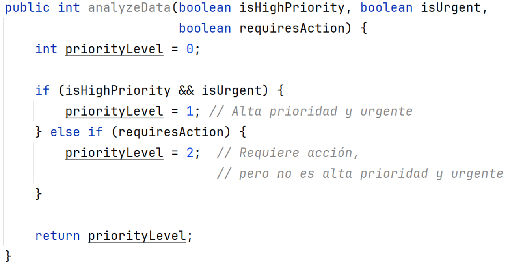

**Entornos de Desarrollo (ED)**
**Unidad de Trabajo 9**
**Tarea 01**

## OBJETIVOS DE APRENDIZAJE

- Diferenciar las técnicas de diseño de pruebas.
- Utilizar técnicas de diseño de pruebas.
- Escribir casos de prueba.

# TA01

## DISEÑO DE PRUEBAS UTILIZANDO EL ENFOQUE DEL CAMINO BÁSICO

#### Rúbrica y guía de calificación:
- [x] Utiliza este documento para responder.
- [x] Se explica el código. *Nota total 3*
- [x] Grafo de flujo correcto.
- [x] Complejidad ciclomática correcta. *Nota total 6*
- [x] Determina la rutas correpondientes.
- [x] Crea la tabla formalmente correcta con los datos correctos resultantes del análisis anterior. *Nota total 9*

#### Explica el funcionamiento del siguiente código

***Inserta aquí la explicación…***

#### Diseña el conjunto de pruebas de caja blanca para el anterior fragmento de código, utilizando el enfoque de prueba de ruta básica explicado anteriormente.
* Numera las sentencias…
* Dibuja el grafo de flujo…
* Calcula la complejidad ciclomáta CC
#### Determina las rutas de acceso correspondientes que se van a probar.
* Tabla con las rutas…
#### Escribe los casos de prueba para probar cada ruta utilizando una tabla.
* Tabla con los casos de prueba…

