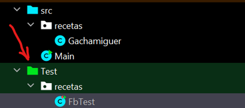
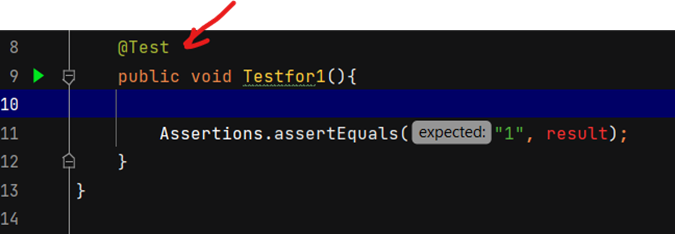

## ENTORNOS DE DESARROLLO 
### PRUEBAS UNITARIAS CON JUNIT ED3c1002

**Entornos de Desarrollo (ED)**
**Unidad de Trabajo 10**
**Tarea 02**

## OBJETIVOS DE APRENDIZAJE

- Escribir pruebas unitarias.
- Ejecutar pruebas unitarias.

# TA02 GACHAMIGUERO

### Qué es TDD

**TDD (Test-Driven Development -- Desarrollo dirigido por pruebas)** es una metodología de diseño de software que se basa en pruebas para guiar el proceso. Algunas ventajas de usar TDD son que el software resultante es de alta calidad y tiene menos errores. Además, la arquitectura del sistema y el código producido son fáciles de comprender y están bien estructurados.

TDD (Test-Driven Development) se implementa siguiendo un proceso específico de tres pasos:

-   Test-First: Las pruebas se escriben antes del propio código a     probar. Esto significa que antes de escribir cualquier código, se definen los casos de prueba que el código debe pasar para ser considerado correcto.

-   Desarrollo: Después de escribir las pruebas, se escribe el código     fuente que pase la prueba satisfactoriamente. Esto significa que el código se considera terminado tan pronto como pasa la prueba.

-   Refactorización posterior: Finalmente, después de que el código haya pasado las pruebas, se refactoriza para mantener la calidad del diseño. Esto implica cambiar el diseño sin cambiar la funcionalidad.

Para escribir las pruebas en TDD (Test-Driven Development), primero se deben definir los casos de prueba que el código debe pasar para ser considerado correcto. Estos casos de prueba se basan en los **requisitos** del software y deben cubrir todas las posibles situaciones que el código debe manejar.

Una vez definidos los casos de prueba, se escriben las pruebas en código utilizando un marco de pruebas (testing framework) adecuado para el lenguaje de programación que se está utilizando. Estas pruebas deben ser automatizadas, es decir, con la sola ejecución del código de pruebas debemos saber si lo que estamos probando funciona bien o mal.

En cuanto a la refactorización del código en TDD, esto implica cambiar el diseño sin cambiar la funcionalidad. Esto se hace para mejorar la calidad del diseño y hacerlo más fácil de entender y mantener. La refactorización puede incluir cosas como reorganizar el código, eliminar duplicados y simplificar la lógica.

Hay muchas herramientas disponibles para implementar TDD. Algunas herramientas comunes incluyen marcos de pruebas (testing frameworks) como JUnit (para Java), NUnit (para .NET) y RSpec (para Ruby).

### El problema

Escribe un programa que imprima los números del 1 al 100. Pero para múltiplos de tres imprime "Gacha" en lugar del número y para los múltiplos de cinco imprime "Miga". Para los números que son a la vez múltiplos de tres y cinco imprime "Gachamiga".

### Qué tengo que hacer

Realiza los siguientes pasos **siguiendo el orden propuesto**, utiliza el lenguaje de programación **JAVA** y el framework **jUnit** en **inteliJ**.

1.  **VERSIÓN V1**: Implementa una solución al problema anterior escribiendo código como lo habrías hecho hasta ahora. Como si fuera una tarea de **Programación**.

> Inserta aquí una imagen del **código** (Recorte de v1) y de la **salida** de su ejecución.

2.  Escribe una tabla de casos de prueba con valores de entrada entre el1 y el 15 y, además, el 30. (16 casos de prueba en total)

> Inserta aquí la Tabla...

3.  **VERSIÓN V2**: Crea una nueva clase en intelliJ para implementar de nuevo el programa siguiendo la metodología TDD:

    * Crea una carpeta Test para guardar las pruebas, a la altura de src.

    * ***Márcala como "source root pruebas"***
    
    

    * Escribe las pruebas para todos los casos de prueba con valores de entrada entre el 1 y el 15 y, además, el 30.

    

    * Cada vez que escribas una prueba, ve implementando la clase para que pase ***exclusivamente*** las pruebas que tienes escritas en ese momento.

> Inserta aquí un Recorte del código de la funcionalidad cuando tienes escrito hasta el séptimo test...

> Inserta aquí un Recorte del código de las pruebas cuando tienes escrito hasta el séptimo test...

> Inserta aquí un Reocorte del resultado de la ejecución de las pruebas... 

1. **VERSIÓN V3** ***Refactoriza*** el código de la segunda versión de la clase para que realice la tarea de otra forma sin cambiar la funcionalidad. ¡Sé creativo!

> Inserta un Recorte del código

   * Demuestra que sigue pasando todas las pruebas.

> Recorte del resultado de las pruebas

### Entrega en PDF

Debes entregar **esta** memoria en PDF en la que describas los pasos que has seguido. *¡No borres nada de los enunciados, solo añade!*

***Con la memoria debe ser suficiente para comprobar que has realizado la práctica correctamente. Solo se corregirá la memoria.***

*Además, entrega el proyecto para que se pueda comprobar en caso de duda.*

## Rúbrica

| Calificación | Descripción                                                                                                                                           |
| ------------ | ----------------------------------------------------------------------------------------------------------------------------------------------------- |
| 0            | No se entrega la tarea o se entrega sin sentido ni conexión con el enunciado                                                                          |
| 3            | Solo se entrega la versión 1                               |
| 6            | Solo se entrega la versión 1 y 2         |
| 9            | Se entrega la versión 1, 2 y 3 |
| 10           | Se han aportado elementos personales más allá de lo solicitado   |

