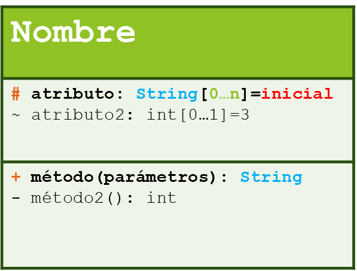
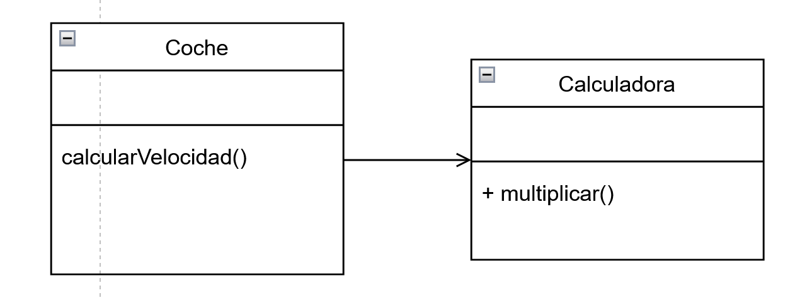
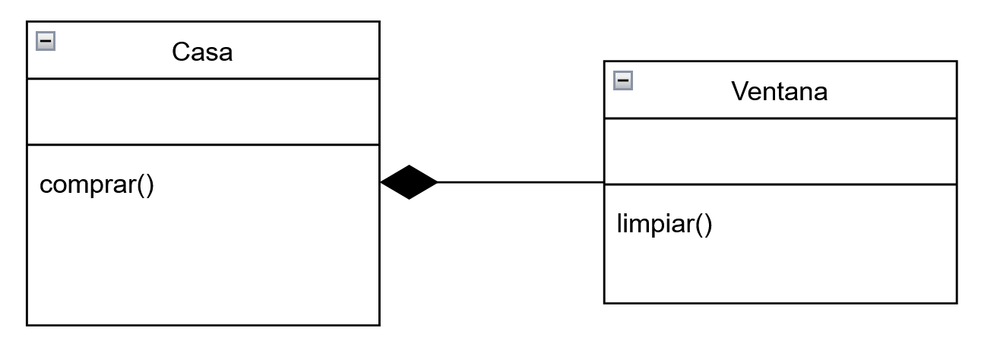
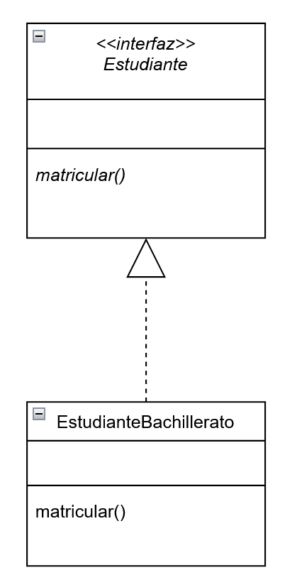

## UML

### Diagramas de clases

En UML (Unified Modeling Language), las clases se representan visualmente mediante diagramas de clases. A continuación, se describen los elementos clave utilizados para representar clases en UML:



1. **Nombre de la Clase:**
   - En la parte superior de la caja que representa la clase, se coloca el nombre de la clase. Este es un elemento esencial y sirve para identificar la clase. Se deben nombrar con la notación CamelCase en mayúsculas

2. **Atributos:**
   - Directamente debajo del nombre de la clase, se enumeran los atributos de la clase. Cada atributo se presenta en la forma "visibilidad nombre: tipo = valor inicial". La visibilidad puede ser pública (+), privada (-), o protegida (#). El tipo representa el tipo de dato del atributo, y el valor inicial indica un valor predeterminado opcional.

3. **Métodos:**
   - Los métodos se representan debajo de los atributos en la forma "visibilidad nombre(parametros): tipoRetorno". Al igual que con los atributos, la visibilidad indica la accesibilidad del método.

4. **Compartimentos:**
   - La clase puede dividirse en compartimentos que contienen atributos y métodos. Los compartimentos pueden ser separados para atributos y métodos públicos, privados o protegidos, proporcionando una organización clara.

5. **Visibilidad:**
   - La visibilidad se representa mediante símbolos antes del nombre del atributo o método. Los símbolos más comunes son "+" para público, "-" para privado y "#" para protegido.

6. **Tipo:**
   - El tipo de dato de los atributos y el tipo de retorno de los métodos se especifican después de los dos puntos (:). Puede ser cualquier tipo de dato válido en el lenguaje de programación que se esté modelando.

7. **Multiplicidad:**
   - La multiplicidad indica cuántas instancias de una clase están asociadas con otra. Se representa como un rango entre corchetes. Por ejemplo, "1..*" indica que puede haber uno o más elementos asociados.

8. **Valor Inicial:**
   - Se utiliza para proporcionar un valor predeterminado para un atributo. Se coloca después del signo igual (=). No todos los atributos necesitan tener un valor inicial.

En resumen, al modelar clases en UML, es crucial tener en cuenta la visibilidad, el tipo, la multiplicidad y, opcionalmente, el valor inicial. Estos elementos proporcionan detalles precisos sobre la estructura interna y el comportamiento de la clase, contribuyendo a un diseño claro y comprensible.

### Relaciones entre clases

En la programación orientada a objetos (POO) y en la notación UML (Unified Modeling Language), hay varias relaciones posibles entre clases para modelar la estructura y el comportamiento de un sistema. Aquí te presento algunas de las relaciones más comunes:

1. **Asociación:**
   - Representa una relación entre dos clases donde un objeto de una clase está relacionado con un objeto de otra clase. Puede ser unidireccional o bidireccional.
     - **Unidireccional:** Una clase está asociada con otra, pero la asociación es unidireccional. Se representa con una línea sólida que va desde la clase de origen a la clase de destino.
     - **Bidireccional:** Ambas clases están asociadas entre sí. Se representan con una línea sólida que conecta ambas clases.
   -  **Ejemplo UML:**
        - Unidireccional: `A --> B`
        - Bidireccional: `A <--> B`
      - Un Coche utiliza la clase Calculadora para calcular la velocidad lineal.
      - La clase Coche debe preocuparse de los cambios que se produzcan en la Calculadora.
  

2. **Agregación:**
   - Representa una relación de "todo-parte", donde una clase (todo) contiene a otra clase (parte). La parte puede existir de forma **independiente** de la clase contenedora.
   - Se representa con un rombo hueco en la clase contenedora.
   - **Ejemplo UML:**
     - Rombo hueco en la clase contenedora: `A <>-- B`
     - La clase Propietario contiene la clase Casa.
     - El propietario debe saber cuáles son sus casas.
     - Si una de las clases desaparece, la otra no deja de existir.

3. **Composición:**
    - Similar a la agregación, pero en este caso la parte no puede existir de forma independiente de la clase contenedora. La existencia de la parte está fuertemente vinculada a la existencia de la clase contenedora.
   - **Ejemplo UML:**
     - Rombo lleno en la clase contenedora: `A <>--* B`
   - Se representa con un rombo lleno en la clase contenedora.
   - La clase Casa contiene instancias de la clase Ventana.
   - Si la Casa desaparece las Ventanas también desaparecen.
  

4. **Herencia (Generalización):**
   - Representa una relación de "es-un". Una clase (subclase) hereda atributos y comportamientos de otra clase (superclase).
   - Se representa con una línea sólida **con una flecha cerrada y hueca** que va desde la subclase hacia la superclase.
   

5. **Realización (Implementación):**
   - Indica que una clase implementa una interfaz o cumple con un contrato definido por una interfaz.
   - Se representa con una línea punteada **con una flecha cerrada y hueca** que va desde la clase implementadora hacia la interfaz.
   - La clase EstudianteBachillerato implementa los métodos de la interfaz ***Estudiante***.
  

Estas son solo algunas de las relaciones que se pueden modelar en UML. La elección de la relación dependerá de la naturaleza de la interacción entre las clases en el sistema que estás modelando.

[Ejemplos de relaciones](./tablaEjemplosRelaciones.md)
[Mapa de los ejemplos](./mapa_ejemplos.html)

### Consecuencias sobre el código Java
Las relaciones en el modelo UML tienen impacto en la forma en que se estructura y organiza el código en Java. A continuación, describo las posibles consecuencias de cada una de las cinco relaciones (Asociación, Agregación, Composición, Herencia y Realización) sobre el código Java:

1. **Asociación:**
   - **Consecuencia en Java:** Se traduce en la creación de campos (variables de instancia) en las clases involucradas para representar la relación entre los objetos. Pueden ser referencias directas o colecciones, dependiendo de la multiplicidad de la asociación.

```java
// Ejemplo de asociación unidireccional
public class A {
   //Atributos   
   //Métodos
   public probar(){
      b.hacer();
   }
}

public class B {
   //Atributos
   //Métodos
   public hacer(){}
}

public class Main{
   public A a = new A();
   public B b = new B();
}
```

2. **Agregación:**
   - **Consecuencia en Java:** ***Similar a la asociación***, pero con la indicación explícita de que la parte (clase agregada) puede existir de forma independiente. Se utilizan referencias a la clase parte.

```java
// Ejemplo de agregación
public class A {
   //Atributos
    private B bDeA = b;
    // ...
}

public class B {
   //Atributos
    // ...
}

public class Main{
   public A a = new A();
   public B b = new B();
}
```

3. **Composición:**
   - **Consecuencia en Java:** Similar a la agregación, pero en este caso, con la indicación explícita de que la parte no puede existir de forma independiente y generalmente se crea y se destruye junto con la clase contenedora.

```java
// Ejemplo de composición
public class A {
   //Atributos
    private B b;
   //Constructor
    public A() {
        b = new B();
    }
    //...
}
```

4. **Herencia:**
   - **Consecuencia en Java:** Se utiliza la palabra clave `extends` para establecer la relación de herencia entre clases. La subclase hereda atributos y métodos de la superclase.

```java
// Ejemplo de herencia
public class A {
    // ...
}

public class B extends A {
    // ...
}
```

5. **Realización (Implementación):**
   - **Consecuencia en Java:** Se utiliza la palabra clave `implements` para indicar que una clase está implementando una interfaz. La clase debe proporcionar implementaciones para todos los métodos definidos por la interfaz. La interfaz se define como `public interface`.

```java
// Ejemplo de realización (implementación)
public interface Interface {
   //El método solamente se declara
    public void metodo();
}

public class A implements Interface {
    public void metodo() {
        // Implementación del método
    }
}
```

Es fundamental recordar que, aunque estas relaciones en el modelo UML brindan un marco conceptual, la implementación concreta en Java puede variar según las necesidades específicas del diseño y del sistema. Además, las relaciones pueden combinarse y usarse de manera conjunta para modelar complejidades en el sistema.

### Otros modificadores
**Modificadores en Java:**

1. **Static:**
   - **Significado:** Indica que un miembro (método o atributo) pertenece a la clase en lugar de a las instancias individuales de la clase. Un miembro estático se comparte entre todas las instancias de la clase y se accede a través del nombre de la clase, no de una instancia.
   - **Representación en UML:** Se indica colocando la palabra "static" antes del nombre del miembro.
   - **Ejemplo en Java:**
     ```java
     public class Ejemplo {
         public static int contador = 0;
         public static void incrementarContador() {
             contador++;
         }
     }
     ```

2. **Final:**
   - **Significado:** Indica que un miembro no puede ser modificado después de su inicialización. En el caso de clases, impide que la clase tenga subclases (heredadas). En el caso de métodos, impide que el método sea sobrescrito en subclases.
   - **Representación en UML:** Se indica agregando "{final}" después del nombre del miembro.
   - **Ejemplo en Java:**
     ```java
     public class Ejemplo {
         public final int valorConstante = 10;
         public final void metodoFinal() {
             // código del método
         }
     }
     ```

3. **Abstract:**
   - **Significado:** Indica que una clase o método no puede ser instanciado directamente o que un método no tiene implementación en la clase actual y debe ser proporcionado por subclases (en el caso de métodos abstractos). Las clases abstractas pueden tener métodos concretos y abstractos.
   - **Representación en UML:** Se indica agregando "{abstract}" antes del nombre de la clase o el método.
   - **Ejemplo en Java:**
     ```java
     public abstract class Figura {
         public abstract double calcularArea();
     }
     ```

**Consecuencias en el Comportamiento:**

1. **Static:**
   - Los miembros estáticos pertenecen a la clase y no a las instancias individuales. Pueden ser accedidos a través del nombre de la clase, y cualquier modificación se reflejará en todas las instancias.
   - No es necesario crear una instancia de la clase para acceder a los miembros estáticos.
   - Se comparten entre todas las instancias y existen durante toda la vida del programa.

2. **Final:**
   - Un miembro final no puede ser modificado después de su inicialización. Si es una variable, su valor no puede cambiar. Si es un método, no puede ser sobrescrito en subclases.
   - Las clases finales no pueden ser heredadas. Esto asegura que la estructura de la clase final no se modifique.

3. **Abstract:**
   - Las clases abstractas no pueden ser instanciadas directamente. Se deben heredar y proporcionar implementaciones para sus métodos abstractos en las subclases.
   - Los métodos abstractos no tienen implementación en la clase actual y deben ser proporcionados por las subclases. Estas subclases deben ser abstractas o proporcionar una implementación concreta para el método abstracto.

En resumen, los modificadores static, final y abstract en Java y UML tienen impacto en la estructura, la instanciación, la herencia y la implementación de clases y miembros, y afectan cómo interactúan los objetos y las clases en un programa.

**Diferencia entre interfaz y clase abstracta**

- **Interfaz:**
  - Define métodos abstractos.
  - No contiene implementaciones de métodos.
  - Permite que una clase implemente múltiples interfaces.
  - Utilizado para definir contratos y comportamientos.

- **Clase abstracta:**
  - Puede contener métodos concretos y abstractos.
  - Permite heredar de una sola clase abstracta.
  - Proporciona una implementación base para clases hijas.
  - Útil para compartir código común y definir un conjunto común de métodos y comportamientos.