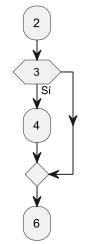
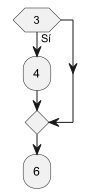
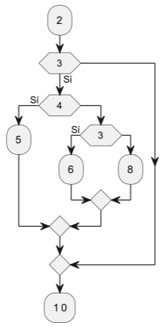
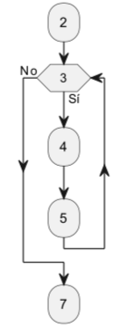
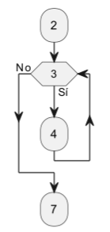
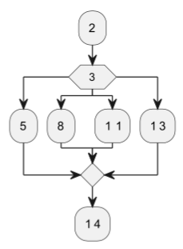

## **1. Secuencia simple**
📌 **Código en Java (con comentarios numerados):**
```java
public void verificarVelocidad(int velocidad, int limite) {  // 1
    System.out.println("Iniciando verificación...");         // 2
    int exceso = velocidad - limite;                         // 3
    System.out.println("El exceso de velocidad es de " + exceso + " km/h"); // 4
    System.out.println("Verificación completada.");          // 5
}  // 6
```

📌 **Grafo:**
 o 


📝 **Complejidad ciclomática:**  
(V(G) = 1) (un solo camino)

---

## **2. Condición `if`**
📌 **Código en Java (con comentarios numerados):**
```java
public void verificarVelocidad(int velocidad, int limite) {  // 1
    System.out.println("Iniciando verificación...");         // 2
    if (velocidad > limite) {                                // 3
        System.out.println("Exceso de velocidad detectado."); // 4
    }  // 5
    System.out.println("Verificación completada.");          // 6
}  // 7
```

📌 **Grafo:**
 o 

📝 **Complejidad ciclomática:**  
(V(G) = 2) (dos caminos posibles)

---

## **3. `if` con múltiples condiciones**
📌 **Código en Java (con comentarios numerados):**
```java
public void verificarVelocidad(int velocidad, int limite, boolean esZonaEscolar) { // 1
    System.out.println("Iniciando verificación...");                               // 2
    if (velocidad > limite && esZonaEscolar) {                                     // 3 vel //4 esZona
        System.out.println("Multa grave: Exceso de velocidad en zona escolar.");   // 5
    } else if (velocidad > limite) {                                              // 6
        System.out.println("Multa leve: Exceso de velocidad.");                    // 6
    } else {                                                                       // 7
        System.out.println("Velocidad dentro del límite.");                        // 8
    }                                                                              // 9
    System.out.println("Verificación completada.");                                // 10
} // 11
```

📌 **Grafo:**


📝 **Complejidad ciclomática:**  
(V(G) = 4) (cuatro caminos posibles)

---

## **4. Bucle `while`**
📌 **Código en Java (con comentarios numerados):**
```java
public void reducirVelocidad(int velocidad) {  // 1
    System.out.println("Reduciendo velocidad..."); // 2
    while (velocidad > 0) { // 3
        System.out.println("Velocidad actual: " + velocidad); // 4
        velocidad -= 10; // 5
    }  // 6
    System.out.println("El vehículo se ha detenido."); // 7
}  // 8
```

📌 **Grafo:**
 o 

📝 **Complejidad ciclomática:**  
(V(G) = 2) (dos caminos)

---

## **5. Bucle `do while`**
📌 **Código en Java (con comentarios numerados):**
```java
public void contarHasta(int max) { // 1
    int i = 1; // 2
    do { // 3
        System.out.println("Contando: " + i); // 4
        i++; // 5
    } while (i <= max); // 6
    System.out.println("Conteo finalizado."); // 7
} // 8
```

📌 **Grafo:**


📝 **Complejidad ciclomática:**  
(V(G) = 2) (el bucle siempre se ejecuta al menos una vez)

---

## **6. `switch-case`**
📌 **Código en Java (con comentarios numerados):**
```java
public void mostrarMensaje(int codigo) { // 1
    switch (codigo) { // 2
        case 1: // 3
            System.out.println("Advertencia: Revisa tu velocidad."); // 4
            break; // 5
        case 2: // 6
            System.out.println("Multa: Exceso de velocidad."); // 7
            break; // 8
        case 3: // 9
            System.out.println("Suspensión de licencia."); // 10
            break; // 11
        default: // 12
            System.out.println("Código inválido."); // 13
    }
    System.out.println("Adiós!");// 14
} // 15
```

📌 **Grafo:**


📝 **Complejidad ciclomática:**  
(V(G) = 4) (cuatro caminos posibles)

